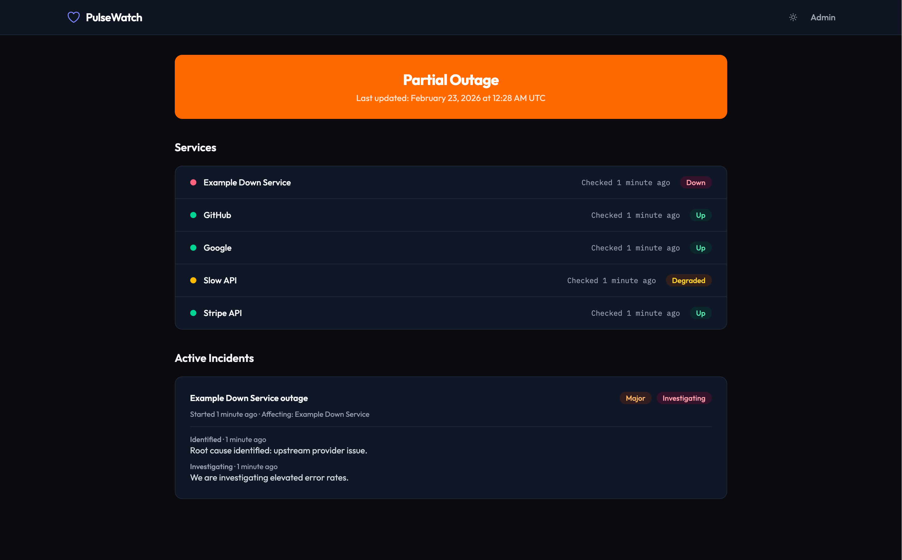
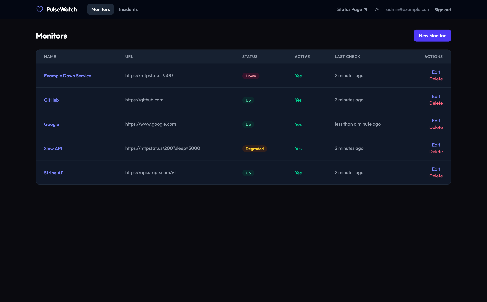
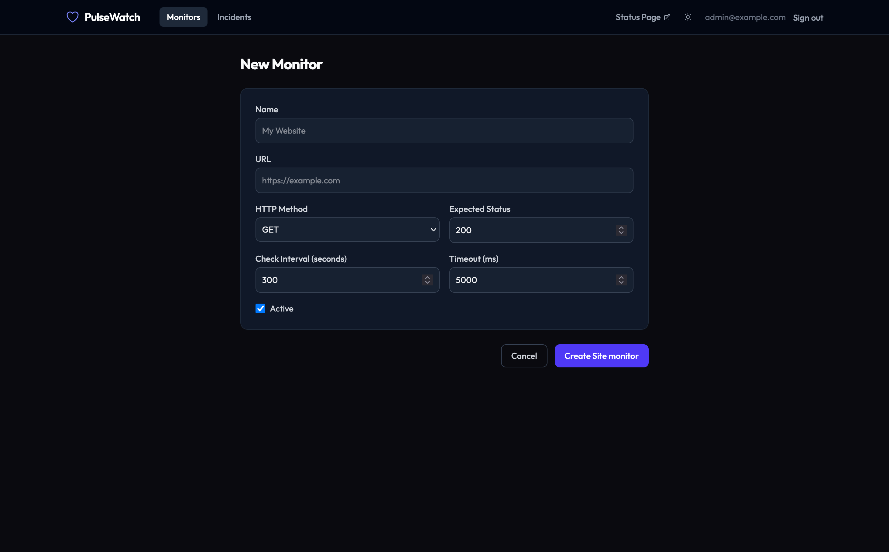

# PulseWatch

PulseWatch is a real-time uptime monitoring and status page application built with Ruby on Rails. It continuously checks the health of your web services, tracks response times, and provides a public-facing status page so your users always know what's going on. When things go wrong, PulseWatch helps you manage incidents with a timeline of updates from investigation through resolution.

## Screenshots

### Public Status Page

The public status page shows the overall system health, individual service statuses, and any active incidents with their full update timelines.



### Admin Dashboard

The admin dashboard gives you a table view of all monitors with their current status, URLs, and last check times. Edit, delete, or create new monitors from here.



### Adding a Monitor

Configure monitors with a name, URL, HTTP method, expected status code, check interval, and timeout. PulseWatch handles the rest.



## Tech Stack

- **Framework:** Ruby on Rails 8.1
- **Database:** PostgreSQL 16
- **Background Jobs:** Sidekiq + sidekiq-cron
- **Real-time:** Turbo Streams (Action Cable)
- **Cache/Queue/Cable:** Redis 7
- **Frontend:** Tailwind CSS, Stimulus, importmap-rails
- **Error Tracking:** Sentry
- **Testing:** RSpec, FactoryBot, Capybara, SimpleCov

## Prerequisites

- **Docker and Docker Compose**

## Setup

```bash
docker compose up --build
```

This starts all services:
- **Rails app** on [http://localhost:3020](http://localhost:3020)
- **Sidekiq** worker for background jobs
- **PostgreSQL 16** on port `5434`
- **Redis 7** on port `6379`

The database is automatically created, migrated, and seeded on startup.

## Default Credentials

| Field    | Value              |
|----------|--------------------|
| Email    | `admin@example.com` |
| Password | `test1234##`       |

Visit [http://localhost:3020/admin](http://localhost:3020/admin) to log in. The public status page at [http://localhost:3020](http://localhost:3020) requires no authentication.

## Running Tests

```bash
docker compose exec web bundle exec rspec

# Model specs
docker compose exec web bundle exec rspec spec/models

# Request specs
docker compose exec web bundle exec rspec spec/requests
```

## API Overview

All API endpoints are under `/api/v1`.

| Method | Endpoint | Description |
|--------|----------|-------------|
| GET | `/api/v1/monitors` | List all monitors |
| POST | `/api/v1/monitors` | Create a monitor |
| GET | `/api/v1/monitors/:id` | Show a monitor |
| PATCH | `/api/v1/monitors/:id` | Update a monitor |
| DELETE | `/api/v1/monitors/:id` | Delete a monitor |
| GET | `/api/v1/monitors/:id/checks` | List checks for a monitor |
| GET | `/api/v1/monitors/:id/uptime` | Get uptime stats |
| GET | `/api/v1/incidents` | List incidents |
| POST | `/api/v1/incidents` | Create an incident |
| GET | `/api/v1/incidents/:id` | Show an incident |
| PATCH | `/api/v1/incidents/:id` | Update an incident |
| PATCH | `/api/v1/incidents/:id/resolve` | Resolve an incident |
| GET | `/api/v1/status` | Public status summary |

## Architecture

```
app/
├── controllers/
│   ├── api/v1/        # JSON API controllers
│   ├── admin/         # Admin web controllers
│   └── status_controller.rb  # Public status page
├── models/
│   ├── site_monitor.rb        # Monitor configuration
│   ├── check.rb               # Health check results
│   ├── incident.rb            # Incident tracking
│   ├── incident_update.rb     # Incident timeline updates
│   └── notification_channel.rb # Alert channels
├── services/
│   ├── monitoring_service.rb  # Performs HTTP checks
│   ├── uptime_calculator.rb   # Computes uptime percentages
│   └── incident_manager.rb    # Incident lifecycle management
└── jobs/
    └── ...                    # Background check jobs
```

## Troubleshooting

<details>
<summary>Port already in use</summary>

Stop whatever is using the port, or change the port mapping in `docker-compose.yml`.

```bash
docker compose down
docker compose up --build
```

</details>

<details>
<summary>Rebuild after Gemfile changes</summary>

```bash
docker compose up --build
```

</details>

## Linting

```bash
docker compose exec web bundle exec rubocop
```

## Security Scanning

```bash
docker compose exec web bin/brakeman --no-pager
docker compose exec web bin/bundler-audit
```
